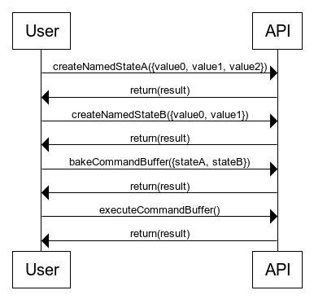
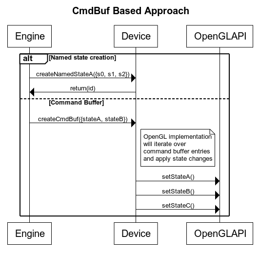

---?color=linear-gradient(175deg, black 80%, silver 20%)

@snap[north span-100 text-13 text-pink]
A story about porting in-house 3D engine to Vulkan
@snapend

@snap[west span-40 text-blue text-bold]
Olgierd Humeńczuk
@snapend

@snap[east span-60 text-07 text-gray]
BIO
@ul[list-square-bullets text-silver](false)
- Has been programming for past 18 years using different programming languages
- Has created multiple game engines including software renderers
- Has been working on high performance networking servers and clients in C and C++
@ulend
@snapend

---?color=linear-gradient(92deg, #444444 50%, silver 50%)

@snap[north span-100 text-pink text-13 text-bold]
About OpenGL and Vulkan
@snapend

@snap[west span-50 text-white text-bold text-07 text-center]
OpenGL
@ul[list-square-bullets]
- OpenGL 1.0 year 1992
- Driver responsibility and overhead: high
- API: getters and setters for global state
- Debugging: get-last-error approach, verification during execution
@ulend
@snapend

@snap[east span-50 text-black text-bold text-07 text-center]
Vulkan
@ul[list-square-bullets]
- Vulkan 1.0 years 2015/2016
- Driver responsibility and overhead: low
- API: still functions but operates on entities such as device, queue or command buffer ( entity based )
- Dubugging: special debug layers, verification only through debug layers
@ulend
@snapend

---?color=linear-gradient(92deg, #444444 50%, silver 50%)

@snap[span-100 text-pink text-13 text-bold]
API comparision
@snapend

@snap[span-100 text-white text-left text-bold text-08]
OpenGL
```cpp
glClearColor(1.0f, 0.0f, 0.0f, 1.0f);
glClear(GL_COLOR_BUFFER_BIT);
```
@snapend

@snap[span-100 text-right text-black text-bold text-08]
Vulkan
```cpp
VkCommandBufferBeginInfo begin_info = {};

begin_info.sType = VK_STRUCTURE_TYPE_COMMAND_BUFFER_BEGIN_INFO;
begin_info.flags = VK_COMMAND_BUFFER_USAGE_SIMULTANEOUS_USE_BIT;

VkClearValue clear_value
    = {VkClearColorValue{1.0f, 0.0f, 0.0f, 1.0f}};

VkImageSubresourceRange image_range = {};
image_range.aspectMask = VK_IMAGE_ASPECT_COLOR_BIT;
image_range.levelCount = 1;
image_range.layerCount = 1;

vkBeginCommandBuffer(cmd_buf, &begin_info);
vkCmdClearColorImage(cmd_buf, img,
    VK_IMAGE_LAYOUT_GENERAL, &clear_value, 1, &image_range);
vkEndCommandBuffer(cmd_buf);
```
@snapend

---?color=linear-gradient(92deg, #444444 50%, silver 50%)
@snap[north span-100 text-pink text-13 text-bold]
Let's build our "Abstraction"
@snapend

@snap[west span-50 text-white text-bold text-07]
OpenGL

@snapend

@snap[east span-50 text-black text-bold text-07]
Vulkan

@snapend

---?color=linear-gradient(92deg, #444444 50%, silver 50%)
@snap[north span-100 text-pink text-13 text-bold]
Dilemma
@snapend

@snap[middlepoint span-100]

@snapend

---?color=linear-gradient(92deg, #444444 50%, silver 50%)
@snap[north span-100 text-pink text-13 text-bold]
The "State Based" approach
@snapend

@snap[west span-50 text-white text-bold text-07]
@ul[list-square-bullets](false)
- Use OpenGL like API
- Each state change is registered in a temporary buffer
- Whenever the state changes fills all required fields or draw/flush encountered gather data and form Vulkan named states
- Verify if Vulkan named state already exist by using entity field hash function
@ulend
@snapend

@snap[east span-50]

@snapend

---?color=linear-gradient(92deg, #444444 50%, silver 50%)
@snap[north span-100 text-pink text-13 text-bold]
The "Command Buffer" approach
@snapend

@snap[west span-50 text-white text-bold text-07]
@ul[list-square-bullets](false)
- Use Vulkan like API
- Form Vulkan like named states
- Use command buffer to prepare graphics commands like in Vulkan
- OpenGL implementation can execute commands directly from the memory
@ulend
@snapend

@snap[east span-50]

@snapend

---?color=linear-gradient(92deg, #444444 50%, silver 50%)
@snap[north span-100 text-pink text-13 text-bold]
Implementation - Abstract device
@snapend

@snap[middlepoint span-100]
```cpp
class abstract_device
{
    virtual state_a_handle create_state_a(
        state_a_create_info&& ) = 0;
    virtual void release( state_a_handle sa ) = 0;

    virtual command_buffer
    create_command_buffer( const
        nv::gfx_cmds::gfx_cmd_union* data, size_t size ) = 0;
    virtual void
    update_command_buffer( command_buffer cb,
        const nv::gfx_cmds::gfx_cmd_union* data, size_t size ) = 0;
    virtual void release( command_buffer cb ) = 0;

    virtual void add_command_buffer_to_execution_queue(
        command_buffer cb ) = 0;
    virtual void submit_execution_queue( bool is_draw ) = 0;
    virtual void wait_for_idle();
};
```
@snapend

---?color=linear-gradient(92deg, #444444 50%, silver 50%)
@snap[north span-100 text-pink text-13 text-bold]
Implementation - Command buffer
@snapend

@snap[middlepoint span-100 text-08]
```cpp
struct cmd_start_recording {};
struct cmd_end_recording {};
struct cmd_set_state_a { state_a_handle h; };

using gfx_cmd_union = safe_union< cmd_start_recording, cmd_end_recording,
    cmd_set_state_a >;

template < sint64 N > class gfx_cmds_recorder
{
public:
    using type = gfx_cmds::gfx_cmd_union;

    constexpr bool rec_cmd( type&& cmd )
    {
        new ( &m_data[m_current_size] ) type( nv::move( cmd ) );
        m_current_size += 1;
        return true;
    }
private:
    sint64 m_current_size;
    type* m_data;
};
```
@snapend

---?color=linear-gradient(92deg, #444444 50%, silver 50%)
@snap[north span-100 text-pink text-13 text-bold]
Implementation - Execution OpenGL
@snapend

@snap[middlepoint span-100 text-08]
```cpp
struct gl_cmd_recorder
{
    template < typename T > void operator()( const T& /*cmd*/ )
    { NV_ASSERT_ALWAYS( false, "Unimplemented!" ); }
    inline void operator()( const nv::gfx_cmds::cmd_start_recording& /*cmd*/ ) { }
    inline void operator()( const nv::gfx_cmds::cmd_end_recording& /*cmd*/ ) { }
    inline void operator()( const nv::gfx_cmds::cmd_set_state_a& cmd )
    {
        const gl_set_state_a_info* state_a_info = m_data.get( cmd.h );
        glClearColor(state_a_info->color);
        ...
    }
    database& m_data;
};

void gl_device::add_command_buffer_to_execution_queue( command_buffer cb )
{
    // instant execution
    gl_command_buffer_info* info = m_command_buffers.get( cb );
    detail::gl_cmd_recorder recorder{m_data};
    for ( uint32 i = 0; i < info->count; ++i )
        visit( recorder, info->cmds[i] );
}
```
@snapend

---?color=#444444 50%
@snap[north span-100 text-pink text-13 text-bold]
Implementation - Visitor
@snapend

@snap[middlepoint span-100]
[Visitor Implementation](https://godbolt.org/z/VM_haa)
@snapend

---?color=#444444 50%

@snap[north span-100 text-pink text-13 text-bold]
Thank you!
@snapend

Questions ?

